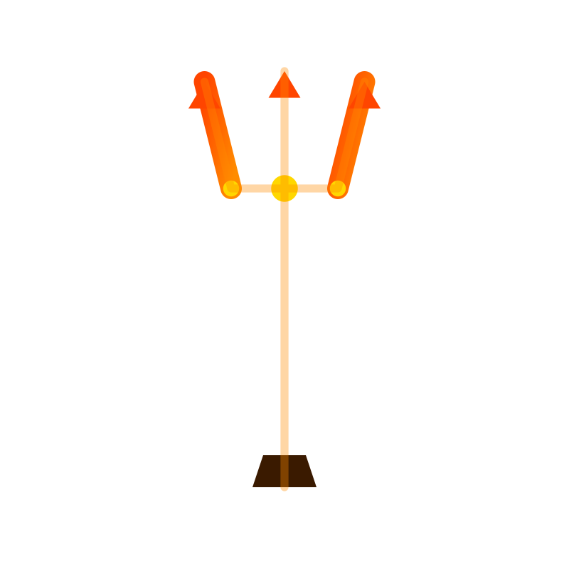

# TITAN Web Scraper 🌐

A modern web application for extracting and analyzing accident-related data from X and Reddit, built with Next.js and Tailwind CSS.



## Features ✨

- **Multi-Platform Scraping**: Extract data from both X and Reddit
- **Keyword-Based Filtering**: Filter results using customizable keywords
- **Interactive UI**: Modern, responsive interface with animations
- **Real-Time Updates**: Live data display with automatic sorting
- **Flexible Views**: Switch between card and table views
- **Recent News Section**: Quick access to latest accident reports

## Tech Stack 🛠️

- **Frontend**: Next.js 14, React, TypeScript
- **Styling**: Tailwind CSS, Framer Motion
- **Data Handling**: CSV parsing, dynamic filtering
- **UI Components**: Custom-built components with animations
- **Icons**: Lucide React

## Getting Started 🚀

1. Clone the repository:
   ```bash
   git clone https://github.com/jalvarez36808/titan-scraper.git
   cd titan-scraper
   ```

2. Install dependencies:
   ```bash
   npm install
   ```

3. Run the development server:
   ```bash
   npm run dev
   ```

4. Open [http://localhost:3000](http://localhost:3000) in your browser

## Usage 📖

1. **Add Keywords**: Use the keyword bank to manage search terms
2. **Configure Search**: Select data source and result limit
3. **Start Scraping**: Click "Start Scraping" to begin data collection
4. **View Results**: Browse results in card or table view
5. **Filter Data**: Use keywords to filter the collected data

## Project Structure 📁

```
titan-scraper/
├── src/
│   ├── app/              # Next.js app directory
│   ├── components/       # React components
│   └── styles/          # Global styles
├── public/              # Static files
└── package.json        # Project dependencies
```

## Contributing 🤝

Contributions are welcome! Please feel free to submit a Pull Request.

## License 📄

This project is licensed under the MIT License - see the [LICENSE](LICENSE) file for details.

## Acknowledgments 🙏

- Built with Next.js and Tailwind CSS
- Icons provided by Lucide React
- Animations powered by Framer Motion